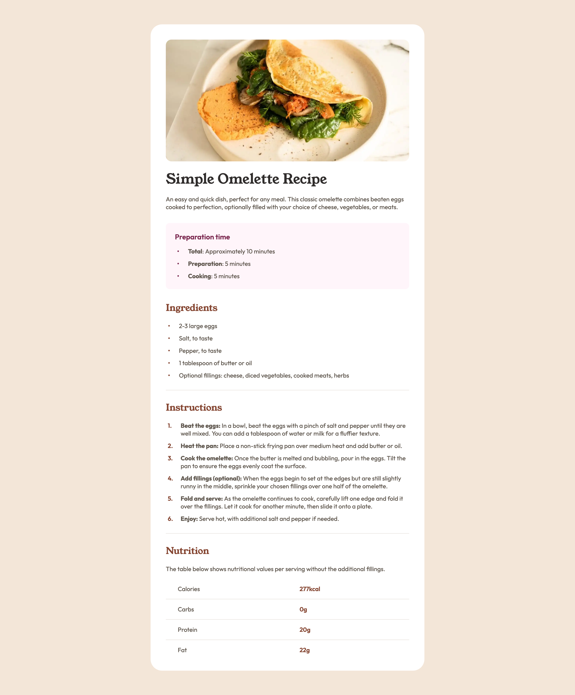
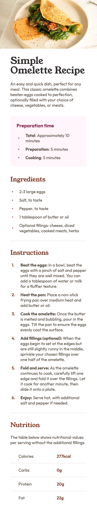

# Frontend Mentor - Recipe page solution

This is a solution to the [Recipe page challenge on Frontend Mentor](https://www.frontendmentor.io/challenges/recipe-page-KiTsR8QQKm). Frontend Mentor challenges help you improve your coding skills by building realistic projects.

## Table of contents

- [Frontend Mentor - Recipe page solution](#frontend-mentor---recipe-page-solution)
  - [Table of contents](#table-of-contents)
  - [Overview](#overview)
    - [Screenshot](#screenshot)
    - [Links](#links)
  - [My process](#my-process)
    - [Built with](#built-with)
    - [What I learned](#what-i-learned)
    - [Continued development](#continued-development)
  - [Author](#author)

**Note: Delete this note and update the table of contents based on what sections you keep.**

## Overview

### Screenshot

Desktop:

Mobile:

### Links

- Solution URL: [GitHub Repo](https://github.com/PatricioZarauz/recipe-page-main)
- Live Site URL: [Vercel](https://recipe-page-main-indol.vercel.app/)

## My process

### Built with

- Semantic HTML5 markup
- SASS
- Flexbox
- CSS Grid
- CSS Table
- Mobile-first workflow

### What I learned

The things I learned through out this project, were the usage of SASS mixins, correct usage of font-sizes and css units, margin priorities and different table properties.

### Continued development

I want to continue improving my mobile-first workflow, web accessability, SASS knowledge and better understanding of tables on css.

## Author

- Frontend Mentor - [@PatricioZarauz](https://www.frontendmentor.io/profile/PatricioZarauz)
